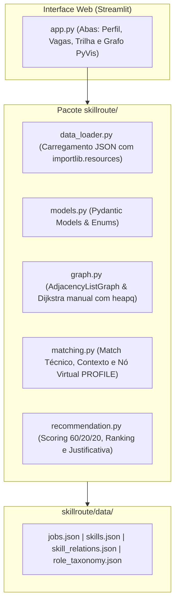

# SkillRoute

Número da Lista: 33<br>
Conteúdo da Disciplina: Algoritmo de Dijkstra e Caminhos Mínimos em Grafos<br>

## Alunos

| Matrícula | Aluno |
| :-- | :-- |
| 22/1022266 | Eric Silveira Gomes |

---

## Sobre

O **SkillRoute** é um sistema acadêmico de recomendação de vagas de tecnologia e planejamento de carreira fundamentado na teoria dos grafos e no **Algoritmo de Dijkstra**.

A proposta central do projeto é superar as limitações do casamento textual raso e dos modelos opacos de recomendação. O sistema mapeia o universo de competências e estados de proficiência como um grafo direcionado ponderado com pesos não negativos. A partir do perfil declarado pelo candidato, o SkillRoute executa o algoritmo de Dijkstra a partir de uma origem virtual (`PROFILE`), determinando a distância mínima de capacitação para cada competência exigida pelas vagas.

A recomendação resultante é **100% determinística, explicável e reproduzível**, combinando prontidão técnica imediata, alinhamento contextual de carreira e esforço mínimo de aprendizado.

### Documentação de Apoio

* 📄 [Documento de Arquitetura e Objetivos Detalhados](file:///home/eric/Área%20de%20trabalho/UnB/PA/G33_Grafos_PA-26.2/SkillRoute_Arquitetura_e_Objetivos.md)
* 🎬 [Roteiro de Gravação do Vídeo de Apresentação](file:///home/eric/Área%20de%20trabalho/UnB/PA/G33_Grafos_PA-26.2/docs/ROTEIRO_VIDEO.md)

### Estatísticas do Dataset Controlado

* **63 vagas sintéticas detalhadas** (9 vagas por área profissional, cobrindo estágios, júnior, pleno, sênior e especialista);
* **141 competências canônicas** cadastradas com identificadores, aliases, descrições e áreas;
* **139 relações direcionadas** de transição tecnológica com custos não negativos;
* **35 famílias canônicas de cargos** com mapeamento de sinonímias e variações de títulos;
* **7 áreas profissionais** representadas (Desenvolvimento, DevOps, Engenharia de Dados, IA/ML, BI, Produto e QA).

---

## Arquitetura Simplificada do Sistema

O projeto adota uma arquitetura direta e concisa:



---

## Critérios de Avaliação e Fórmulas de Compatibilidade

A nota final é calculada de forma totalmente transparente e explicável:

$$\text{Nota Final} = 0{,}60 \times \text{Match Técnico} + 0{,}20 \times \text{Match de Contexto} + 0{,}20 \times \text{Proximidade aos Requisitos por Dijkstra}$$

---

### 1. Match Técnico (Peso: 60%)

Avalia as competências e níveis atuais declarados pelo candidato frente aos requisitos da vaga.

Para cada requisito $i$:

$$\text{atendimento}_i = \min\left(\frac{\text{nível atual}_i}{\text{nível exigido}_i}, 1{,}0\right)$$

$$\text{pontos obtidos}_i = \text{atendimento}_i \times \text{peso}_i$$

$$\text{Match Técnico (\%)} = \frac{\sum_i \text{pontos obtidos}_i}{\sum_i \text{peso}_i} \times 100$$

* **Nível igual ou superior:** Atende $100\%$ do requisito;
* **Nível inferior:** Recebe pontuação proporcional (ex.: Básico [1] para Intermediário [2] = $50\%$);
* **Nível Nenhum:** Recebe $0\%$;
* Requisitos obrigatórios (`required`) possuem maior peso ($4$ a $5$) que desejáveis (`desirable`, peso $1$ a $2$).

---

### 2. Match de Contexto Profissional (Peso: 20%)

Avalia a afinidade de carreira do candidato em relação à vaga em 3 dimensões objetivas (máximo de 100 pontos):

* **Área Profissional (até 50 pontos):**
  * Mesma área da vaga: **+50 pts**;
  * Área correlata: **+25 pts**;
  * Área distinta: **0 pts**.
* **Família Canônica de Cargo (até 30 pontos):**
  * Mesma família canônica de cargo (ex.: *Backend Engineer* vs *Desenvolvedor Backend*): **+30 pts**;
  * Cargo correlato dentro da mesma área: **+15 pts**;
  * Cargo não relacionado: **0 pts**.
* **Senioridade (até 20 pontos):**
  * Mesma senioridade da vaga: **+20 pts**;
  * Senioridade adjacente ($\pm 1$ nível, ex.: Júnior vs Pleno): **+10 pts**;
  * Diferença superior a um nível: **0 pts**.

$$\text{Match de Contexto (\%)} = \text{pontos área} + \text{pontos cargo} + \text{pontos senioridade}$$

---

### 3. Proximidade aos Requisitos por Dijkstra (Peso: 20%)

> **Definição:** Mede o esforço estimado para atingir os níveis que ainda faltam no perfil. Quanto menor o custo acumulado do caminho encontrado pelo Dijkstra, maior é a facilidade estimada e a pontuação de proximidade.

O cálculo da proximidade é realizado **estritamente sobre os requisitos ainda não atendidos integralmente**:

Para cada requisito ausente ou parcialmente atendido $j$ com distância mínima $d_j$:

$$\text{proximidade}_j = \max\left(0, 100 \times \left(1 - \frac{d_j}{10}\right)\right)$$

* **Distância 0,0:** $100\%$ de proximidade;
* **Distância 2,0:** $80\%$ de proximidade;
* **Distância 5,0:** $50\%$ de proximidade;
* **Distância 8,0:** $20\%$ de proximidade;
* **Distância $\ge 10,0$ ou inalcançável:** $0\%$ de proximidade;
* **Se todos os requisitos já estiverem atendidos:** Proximidade geral de $100\%$.

A proximidade consolidada da vaga é a média ponderada pelo peso dos requisitos pendentes:

$$\text{Proximidade Dijkstra (\%)} = \frac{\sum_{j \in \text{pendentes}} (\text{proximidade}_j \times \text{peso}_j)}{\sum_{j \in \text{pendentes}} \text{peso}_j}$$

---

### 4. Tratamento de Perfil Sem Dados

Quando o perfil do candidato não possui informações mínimas preenchidas (nenhuma competência cadastrada):
* Nenhuma métrica é inferida por padrões ou fallbacks;
* O sistema atribui status `not_evaluated`, exibindo $0\%$ em todas as dimensões e uma mensagem orientativa para preenchimento.

---

### 5. Composição e Justificativa da Nota

A interface apresenta 3 cartões dedicados para cada vaga recomendada:

| Dimensão | Pontuação | Peso | Contribuição na Nota |
| :-- | :--: | :--: | :--: |
| **1. Match Técnico** | 85,0% | 60% | 51,0 pts |
| **2. Contexto Profissional** | 90,0% | 20% | 18,0 pts |
| **3. Proximidade por Dijkstra** | 62,5% | 20% | 12,5 pts |
| **Nota Final Consolidada** | — | — | **81,5%** |

$$\text{Nota Final} = (0{,}60 \times 85{,}0) + (0{,}20 \times 90{,}0) + (0{,}20 \times 62{,}5) = \mathbf{81{,}5\%}$$

---

### 6. Faixas de Classificação

| Porcentagem Final | Classificação |
| :-- | :-- |
| **80,00% a 100,00%** | Excelente compatibilidade |
| **65,00% a 79,99%** | Boa compatibilidade |
| **50,00% a 64,99%** | Compatibilidade moderada |
| **30,00% a 49,99%** | Baixa compatibilidade |
| **0,00% a 29,99%** | Compatibilidade muito baixa |

---

## Modelagem do Grafo e Algoritmo de Dijkstra

### Níveis de Proficiência e Expansão de Vértices

Cada uma das 141 competências canônicas é expandida nos 5 estados ordinais:
1. `skill:nenhum` (nível 0)
2. `skill:basico` (nível 1)
3. `skill:intermediario` (nível 2)
4. `skill:avancado` (nível 3)
5. `skill:especialista` (nível 4)

O construtor do grafo insere arestas internas de progressão contínua:
* $0 \rightarrow 1$ (custo 2)
* $1 \rightarrow 2$ (custo 3)
* $2 \rightarrow 3$ (custo 4)
* $3 \rightarrow 4$ (custo 5)

### Diferença entre Nível, Peso e Custo

* **Nível ($0$ a $4$):** Proficiência técnica exigida pela vaga ou declarada pelo candidato.
* **Peso ($1$ a $5$):** Importância relativa do requisito na vaga (obrigatório vs desejável).
* **Custo ($\ge 0$):** Distância/esforço na aresta do grafo para evoluir de um estado a outro.

### Vértice Virtual `PROFILE` e Execução Única do Dijkstra

1. Um nó de origem temporário `PROFILE` é adicionado ao grafo.
2. São criadas arestas com **custo 0** de `PROFILE` para os níveis dominados pelo candidato (e todos os níveis inferiores). Para competências não declaradas, liga-se a `skill:nenhum`.
3. Uma **única execução de Dijkstra** manual com `heapq` a partir de `PROFILE` computa o vetor de distâncias mínimas para todo o grafo em tempo $O((V + E) \log V)$.
4. Para cada requisito da vaga, o menor caminho individual é reconstruído a partir do mapa `previous`.

### Visualização Interativa do Grafo (PyVis)

A interface gráfica apresenta a visualização em rede com layout hierárquico da esquerda para a direita (`LR`), em que a posição horizontal expressa a sequência exata do percurso:

$$\text{PROFILE} \longrightarrow \text{Nível Atual} \longrightarrow \text{Níveis Intermediários} \longrightarrow \text{Requisito da Vaga}$$

#### Código de Cores dos Nós (Paleta de 3 Cores):
* 🟣 **Roxo (`#8B5CF6`):** Nó virtual `PROFILE`, ponto de partida do perfil do candidato no Dijkstra.
* 🟢 **Verde (`#22C55E`):** Competência e nível já dominados pelo candidato que atendem ao requisito (se for requisito atendido da vaga, possui destaque com borda roxa).
* 🔴 **Vermelho (`#EF4444`):** Competência ou nível que ainda precisa ser alcançado / a aprender (o requisito final da vaga possui borda vermelha mais espessa).

#### Arestas e Custos:
* As arestas direcionadas possuem rótulos no formato `Custo: X` e espessura proporcional ao destaque da transição.
* **Relação Custo vs Facilidade:** Quanto **menor** o custo acumulado de um caminho, **maior** é a facilidade estimada de atingir o requisito a partir do perfil atual.

#### Modos de Visualização:
1. **Caminhos separados por requisito (Padrão):** Permite selecionar um requisito específico da vaga e inspecionar seu menor caminho isolado com métricas, contagem de transições e interpretação textual explicativa.
2. **União dos menores caminhos:** Exibe todos os menores caminhos calculados em um único grafo hierárquico, unificando visualmente os nós compartilhados. Esta visualização representa a sobreposição visual das trilhas mínimas individuais.

---

## Screenshots

<!-- TODO: adicionar screenshot da tela de perfil -->
<!-- TODO: adicionar screenshot das recomendações com breakdown da nota -->
<!-- TODO: adicionar screenshot do caminho mínimo e grafo interativo PyVis -->

---

## Instalação e Execução

**Linguagem:** Python 3.12+<br>
**Framework:** Streamlit<br>

### 1. Criar e Ativar Ambiente Virtual

```bash
python -m venv .venv
source .venv/bin/activate  # Windows: .venv\Scripts\activate
```

### 2. Instalar Dependências

```bash
make install
# ou: pip install -e ".[dev]"
```

### 3. Executar a Aplicação Web

```bash
make run
# ou: streamlit run app.py
```

Acesse a interface no navegador em `http://localhost:8501`.

---

## Qualidade e Empacotamento

| Comando | Descrição |
| :-- | :-- |
| `make lint` | Executa a análise estática com `ruff` |
| `make format` | Aplica a formatação automática de código com `ruff format` |
| `make build` | Constrói os pacotes de distribuição (`wheel` e `sdist`) com `python -m build` |
| `make check` | Executa lint, checagem de formato e build em sequência |
| `make clean` | Remove arquivos temporários de build e caches |

---

## Estrutura do Repositório

```text
.
├── .github/
│   └── workflows/
│       └── ci.yml                 # Pipeline GitHub Actions (Lint & Build)
├── assets/
│   └── screenshots/               # Capturas de tela para documentação
├── skillroute/
│   ├── data/                      # Datasets JSON empacotados
│   │   ├── jobs.json              # 63 vagas sintéticas detalhadas
│   │   ├── role_taxonomy.json     # 35 famílias de cargos e sinonímias
│   │   ├── skill_relations.json   # 139 relações entre tecnologias
│   │   └── skills.json            # 141 competências canônicas
│   ├── __init__.py
│   ├── data_loader.py             # Carregamento JSON e construção do grafo
│   ├── graph.py                   # AdjacencyListGraph e Dijkstra manual (heapq)
│   ├── matching.py                # Match técnico, contexto e nó PROFILE
│   ├── models.py                  # Modelos Pydantic v2 e enumerações
│   └── recommendation.py          # Motor de ranqueamento e justificativa
├── app.py                         # Interface web Streamlit (3 abas)
├── .gitignore
├── .python-version
├── Makefile                       # Automação de comandos
├── pyproject.toml                 # Metadados do pacote e dependências
└── README.md
```

---

## Decisões de Projeto e Ajustes de Desenvolvimento

Durante o ciclo iterativo de concepção, implementação e refinamento do SkillRoute, os seguintes problemas conceituais e visuais foram identificados e solucionados:

1. **Tratamento de Perfil Vazio:** Inicialmente, um perfil sem competências preenchidas recebia notas parciais provenientes de fallbacks de contexto e distâncias residuais. Foi implementado o estado estrito `not_evaluated`, zerando todas as notas e solicitando o preenchimento inicial.
2. **Explicabilidade da Proximidade por Dijkstra:** O cálculo foi ajustado para incidir estritamente sobre requisitos pendentes, relacionando a distância mínima $d$ com a fórmula $\max(0, 100 \times (1 - d/10))$ e explicitando que menor custo significa maior facilidade de transição.
3. **Detalhamento das 3 Dimensões:** A composição da nota ($60\%$ Técnico, $20\%$ Contexto e $20\%$ Proximidade) foi decomposta em 3 cartões dedicados, apresentando a pontuação obtida, peso e cálculo exato de Área ($50$), Cargo ($30$) e Senioridade ($20$).
4. **Padronização e Semântica de Cores do Grafo:** A paleta de cores foi refinada para um esquema unificado de 3 cores (🟣 Roxo para a origem `PROFILE`, 🟢 Verde para competências já dominadas/atendidas e 🔴 Vermelho para requisitos pendentes e etapas a aprender), corrigindo incoerências visuais anteriores.
5. **Enquadramento e Visibilidade do Nó PROFILE:** Foi adicionado cálculo topológico de níveis hierárquicos e script de auto-fit com padding, eliminando cortes nas arestas e garantindo que a origem `PROFILE` inicie totalmente visível na primeira coluna da esquerda.
6. **Consolidação e Simplificação da Arquitetura:** O layout de diretórios foi consolidado diretamente no pacote `skillroute/` (eliminando pastas intermediárias `src/` e camadas desnecessárias) e scripts auxiliares foram integrados no `Makefile`, resultando em um código mais limpo, manutenível e focado na entrega acadêmica.

---

## Limitações da Base Sintética

* Os dados de vagas, tecnologias e relações são **sintéticos e acadêmicos**, projetados para exercitar e demonstrar o comportamento algorítmico do Dijkstra em grafos de competência.
* Os pesos e custos de transição representam estimativas pedagógicas de esforço de aprendizado.
